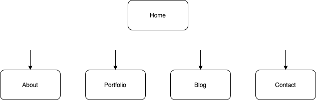

# About

This is a portfolio website completed as part of an assignment for Coder Academy.

## The published Portfolio site: 
https://kind-mclean-654ed4.netlify.app

## Github repository: 
https://github.com/TimothyDunk/portfolio-website

## Purpose
The purpose of this website is to create a portfolio website to present myself as a dev and IT professional. 

The website should provide an online portfolio that provides information about me, my skills, interests, professional knowledge and a showcase of my work. 

## Functionality/ Features

* Name
* Links to Github, LinkedIn and Codepen
* Nav Bar that visualises which page the browser is viewing
* Link to pdf of CV
* Small overview of experience
* Icons to visualise skills
* Information on personality, skills, and interests
* Six blog posts with dates, titles and pictures
* Portfolio section with screenshots and links to github repositories and Netlify if applicable
* Contact form

## Sitemap

## Screenshots

## Target Audience
The target audience is an employer looking to hire a web developer and/or an IT professional.

The audience will expect a high level of technical knowledge relating to information technology, software development and coding, programming languages, and development stacks.

## Tech Stack
* HTML
* CSS
* Netlify
* Git
* Github 